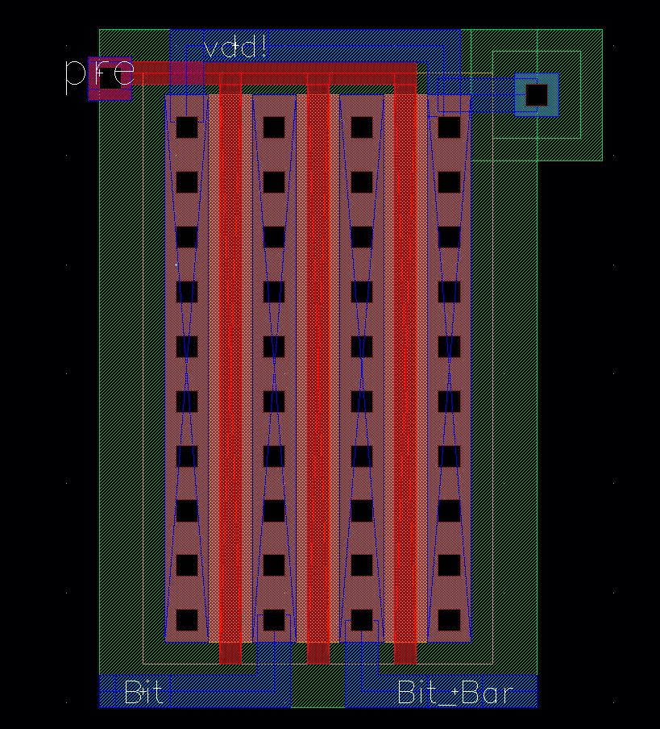

"# 512-Bit-SRAM" 

Steps to Design 512-Bit SRAM

1)	Precharge circuit, 6T SRAM cell, Sense Amplifier and Write Circuit were designed along with dummy transistors and the write data path circuit was designed to test the single cell functionality.
2)	A column of the bank with 8 SRAM cells along with the precharge, sense amplifier and write circuit, was tested before making the bank.
3)	Write and Read multiplexers were designed using the given specifications.
4)	The 128 bit (8 x 16) bank was developed and its working was tested by writing a 16-bit value and reading it out.
5)	Bank select and row decoders were designed and it was verified if the output select signals were correct.
6)	A 16-bit Register was designed using 16 D flip-flops in order to register the data to be read.
7)	The final schematic was rigged and a buffer was added between the Sense Amplifier output and the Register input in order to provide sufficient time for the Register to latch its input.
8)	The final schematic was simulated with a vector file as input and the outputs were verified.
9)	Layouts for all the basic components were successfully designed and LVS was verified but had issues with the final layout and was unable to complete it.

512-Bit SRAM architecture

SRAM Architecture

Input and output Specification

Sense Amplifier

Write Data Path

Single Bit SRAM design

The SRAM cell is designed using the 6T model and the sizing is as follows:
	       
Pull-up Transistors : Length--> 200nm,  Height--> 400nm
Pull –down Transistors : Length--> 200nm, Height--> 600nm
Access Transistors: Length--> 200nm, Height--> 400nm

One-Bit SRAM 

Layout Designs:

1)Sense Amplifier

2)Write Circuit

3)PreCharge Circuit

4)Bank select

5)Row Decoder

6)SRAM Bank

7)Read Mux

8)Write Mux

9)6T SRAM

10)512 Bit SRAM

